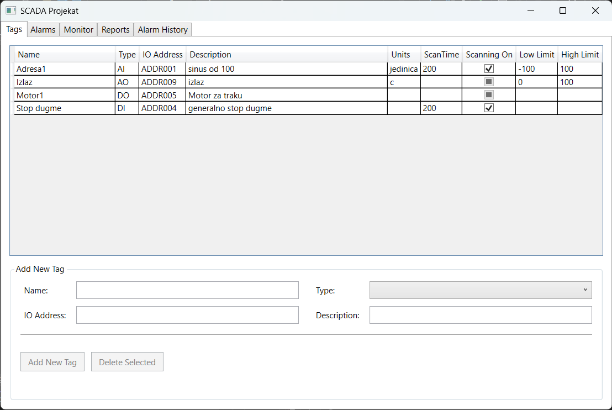
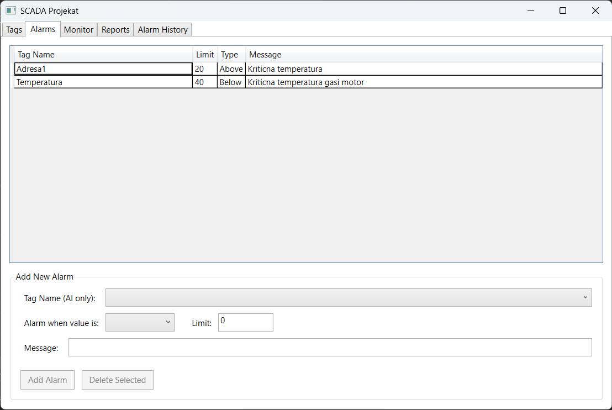
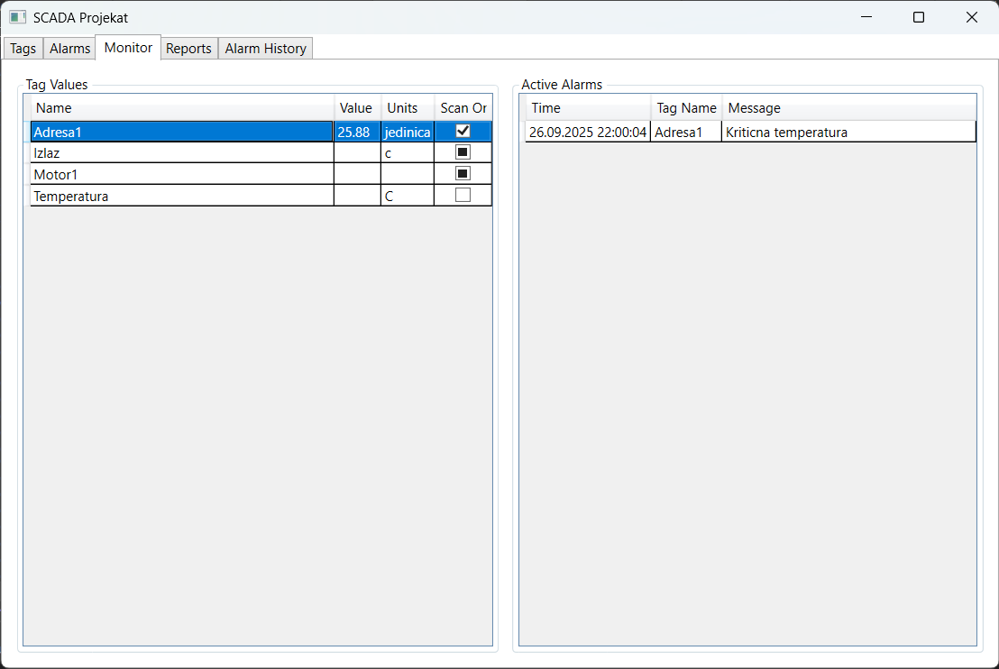
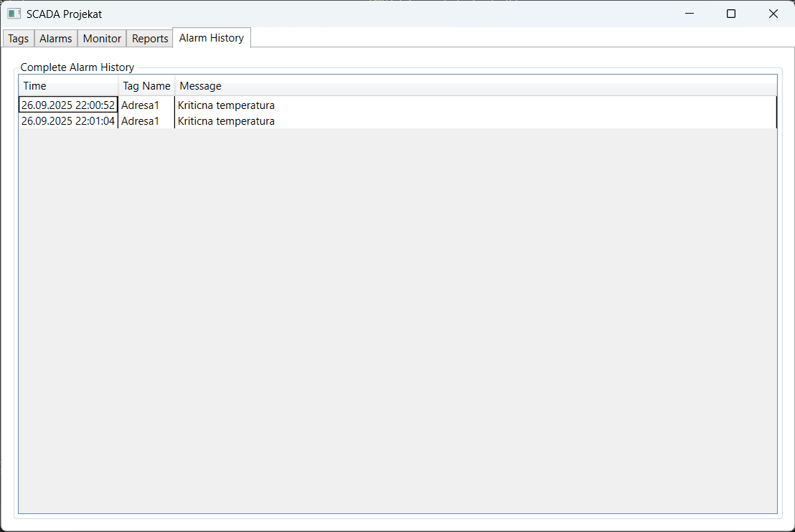
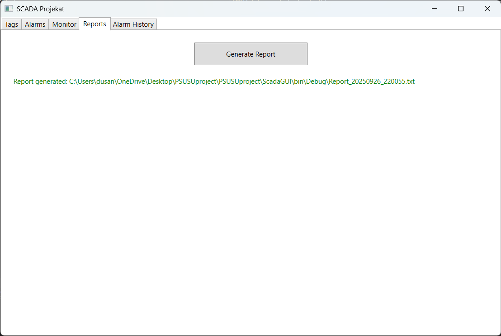
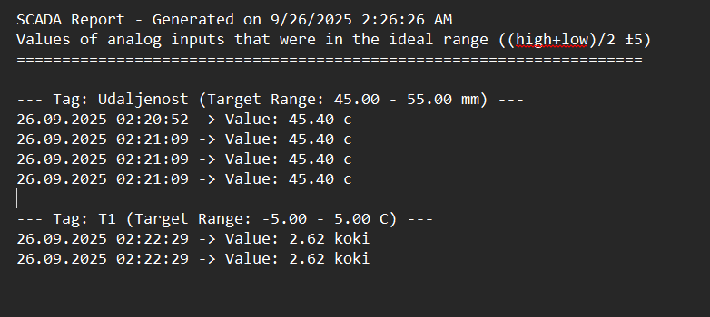

# SCADA System - Academic Project

A proof-of-concept SCADA (Supervisory Control and Data Acquisition) system developed as an academic project in C# with .NET Framework. This educational project demonstrates industrial process monitoring and control concepts through a modern WPF interface.

## Project Overview

This academic project simulates a complete industrial SCADA environment to demonstrate key concepts in industrial automation, real-time data acquisition, alarm management, and historical reporting. The system showcases a multi-layered architecture with a WPF graphical user interface, central data processing engine, and simulated PLC for educational purposes.

### Learning Objectives
- **WPF Development**: Demonstrates modern desktop application development with MVVM pattern
- **Real-Time Systems**: Shows concepts of real-time data processing and event-driven architecture
- **Database Integration**: Illustrates Entity Framework Code-First approach with SQL Server
- **Industrial Concepts**: Teaches SCADA principles, tag management, and alarm systems
- **Software Architecture**: Showcases layered architecture and separation of concerns
- **Testing Practices**: Includes comprehensive testing strategies for educational purposes

## Table of Contents

- [System Architecture](#system-architecture)
- [Application Interface](#application-interface)
  - [Tags Management Tab](#tags-management-tab)
  - [Alarm Management Tab](#alarm-management-tab)
  - [Real-Time Monitoring Tab](#real-time-monitoring-tab)
  - [Alarm History Tab](#alarm-history-tab)
  - [Reports Tab](#reports-tab)
- [Core System Features](#core-system-features)
- [Technology Stack](#technology-stack)
- [Quick Start](#quick-start)

## System Architecture

This educational project demonstrates a decoupled, multi-project architecture designed to teach software engineering principles and industrial automation concepts.

*   **ScadaGUI (WPF Application)**: The primary user interface demonstrating MVVM (Model-View-ViewModel) design pattern. This component teaches students about modern desktop application development, data binding, and event-driven programming. It subscribes to events from the `DataConcentrator` to learn about real-time UI updates.

*   **DataConcentrator (Core Logic)**: The central processing unit that demonstrates industrial data acquisition concepts. This educational component shows:
    *   How to poll external data sources at configurable intervals
    *   Real-time alarm evaluation and threshold monitoring
    *   Database integration for event logging
    *   Event publishing patterns for loose coupling
    *   Configuration management and data persistence

*   **PLCSimulator (Data Source)**: A simulated Programmable Logic Controller that teaches students about industrial automation concepts. This educational tool:
    *   Demonstrates background threading and continuous data generation
    *   Simulates realistic industrial sensor behavior
    *   Shows I/O address mapping concepts
    *   Provides hands-on experience with industrial data formats

*   **Database (Persistence Layer)**: Uses SQL Server LocalDB to teach database concepts and Entity Framework integration. The educational database design includes:
    1.  `Tags`: Demonstrates configuration data modeling
    2.  `Alarms`: Shows relationship modeling and constraint concepts
    3.  `ActivatedAlarms`: Teaches historical data logging and audit trails

## Application Interface

This educational project demonstrates a modern WPF interface with five main tabs, each designed to teach specific aspects of industrial process monitoring and control systems.

### Tags Management Tab


The Tags tab demonstrates the fundamental concept of data point configuration in SCADA systems, teaching students how to manage different types of industrial data sources.

**Educational Concepts:**
- **Tag Types**: Teaches four fundamental industrial data types:
  - **DI (Digital Input)**: Binary state from field devices (switches, sensors)
  - **DO (Digital Output)**: Binary commands to field devices (lights, relays)
  - **AI (Analog Input)**: Continuous values from sensors (temperature, pressure, flow)
  - **AO (Analog Output)**: Continuous commands to actuators (valves, motors)

- **Dynamic UI Design**: Demonstrates conditional UI rendering based on data types:
  - **Common Properties**: Name, Description, I/O Address
  - **Input Properties**: Scan Time (ms), On/Off Scan toggle
  - **Analog Properties**: Low/High Limits, Units (°C, %, PSI, etc.)
  - **Output Properties**: Initial Value for system startup

- **Input Validation**: Shows proper data validation techniques and error handling patterns

### Alarm Management Tab


The Alarms tab teaches students about industrial alarm systems and process monitoring concepts.

**Educational Concepts:**
- **Alarm Configuration**: Demonstrates how to create and manage alarms for Analog Input tags
- **Threshold Monitoring**: Shows Above/Below trigger conditions and limit setting
- **Message Management**: Teaches custom alarm message definition and management
- **Data Relationships**: Illustrates how to link alarms to specific data sources

### Real-Time Monitoring Tab


The Monitor tab demonstrates real-time data visualization and control concepts in industrial systems.

**Educational Concepts:**
- **Real-Time Data Binding**: Shows how to display live data updates in WPF grids
- **Manual Control Interface**: Teaches direct control of output devices with validation
- **Event-Driven Updates**: Demonstrates real-time alarm display and notification systems
- **System Status Monitoring**: Illustrates comprehensive process visibility and control

### Alarm History Tab


The Alarm History tab teaches students about historical data analysis and audit trail concepts.

**Educational Concepts:**
- **Historical Data Management**: Demonstrates how to store and retrieve historical alarm records
- **Event Logging**: Shows timestamping and detailed event information storage
- **Data Analysis Patterns**: Teaches how to analyze historical trends and patterns
- **Audit Trail Implementation**: Illustrates compliance and troubleshooting data requirements

### Reports Tab


The Reports tab demonstrates automated report generation and data analysis concepts.

**Educational Concepts:**
- **Report Generation**: Shows how to create automated reports from historical data
- **Performance Analysis**: Teaches data analysis techniques for identifying optimal operation periods
- **Mathematical Calculations**: Demonstrates formula implementation `(high_limit + low_limit) / 2 ±5`
- **File Management**: Illustrates timestamped file creation and organization techniques

### Generated Report Example


This example demonstrates the output format and analysis capabilities of the educational reporting system.

## Educational Implementation Details

### 1. Tag Management System

This educational project demonstrates the core concept of "tags" in SCADA systems, which represent individual data points from industrial processes.

**Tag Types and Properties:**
- **Digital Input (DI)**: Binary state from field devices (switches, sensors)
- **Digital Output (DO)**: Binary commands to field devices (lights, relays)  
- **Analog Input (AI)**: Continuous values from sensors (temperature, pressure, flow)
- **Analog Output (AO)**: Continuous commands to actuators (valves, motors)

**Educational Implementation:**
- Dynamic UI demonstrating conditional rendering based on data types
- Input validation patterns at both UI and data model levels
- Configuration management for units, limits, scan times, and initial values
- Error handling and validation techniques

### 2. Alarm Management System

Educational implementation of industrial alarm systems for process monitoring.

**Learning Objectives:**
- Alarm configuration for Analog Input tags
- Threshold-based trigger conditions (Above/Below)
- Custom message management and display
- Real-time alarm evaluation and notification patterns

**Implementation Concepts:**
1. Continuous monitoring algorithms for AI tag values
2. Database integration for alarm event logging
3. Event-driven GUI updates for active alarms
4. Historical data tracking and analysis techniques

### 3. Real-Time Data Processing

**Educational Data Flow:**
- PLC Simulator demonstrating realistic process data generation
- DataConcentrator showing polling and processing patterns
- Real-time alarm evaluation and event publishing
- Event-driven architecture for live GUI updates

**Control System Concepts:**
- Manual control interfaces with input validation
- Real-time value updates and status monitoring
- Thread-safe concurrent operations
- Error handling and validation patterns

### 4. Historical Data and Reporting

**Database Integration Learning:**
- SQL Server LocalDB for educational data storage
- Entity Framework Code-First approach demonstration
- Audit trail implementation for system events
- Query optimization for historical data access

**Report Generation Concepts:**
- Automated analysis of historical data
- Performance period identification algorithms
- File management and timestamping techniques
- Data analysis and trend identification

### 5. Automated Testing Suite

Educational testing framework demonstrating software quality practices.

**Testing Concepts:**
- Database initialization and schema validation
- CRUD operations testing for all entities
- Input validation and error handling testing
- Edge cases and boundary condition testing
- Concurrent operations and thread safety testing
- Integration testing across all components

## Technology Stack

*   **Language**: C#
*   **Framework**: .NET Framework 4.7.2
*   **User Interface**: WPF (Windows Presentation Foundation) with MVVM
*   **Data Access**: Entity Framework 6 (Code-First)
*   **Database**: SQL Server LocalDB

## Getting Started (Academic Use)

### Prerequisites

- **Visual Studio 2019 or newer** with .NET desktop development workload
- **SQL Server LocalDB** (included with Visual Studio)
- **Windows 10/11** (WPF requirement)
- **Basic knowledge of C# and WPF** (recommended for educational purposes)

### Setup Instructions

1. **Clone the Repository**
   ```bash
   git clone <repository-url>
   cd PSUSUproject
   ```

2. **Open in Visual Studio**
   - Open `PSUSUproject.sln` in Visual Studio
   - Allow NuGet package restoration when prompted

3. **Build the Solution**
   - Build > Build Solution (Ctrl+Shift+B)
   - Ensure all projects compile successfully

4. **Set Startup Project**
   - Right-click `ScadaGUI` project → "Set as Startup Project"

5. **Run the Application**
   - Press F5 or click "Start" button
   - Database will be automatically created on first run

### Educational Exercise

1. **Explore Tag Management**: Navigate to the Tags tab and experiment with different tag types
2. **Configure Alarms**: Use the Alarms tab to set up monitoring thresholds
3. **Monitor Real-Time Data**: Switch to the Monitor tab to observe live data updates
4. **Analyze Historical Data**: Use the Alarm History tab to review past events
5. **Generate Reports**: Use the Reports tab to create performance analysis reports

This project is designed for educational purposes and demonstrates key concepts in industrial automation and software development.
